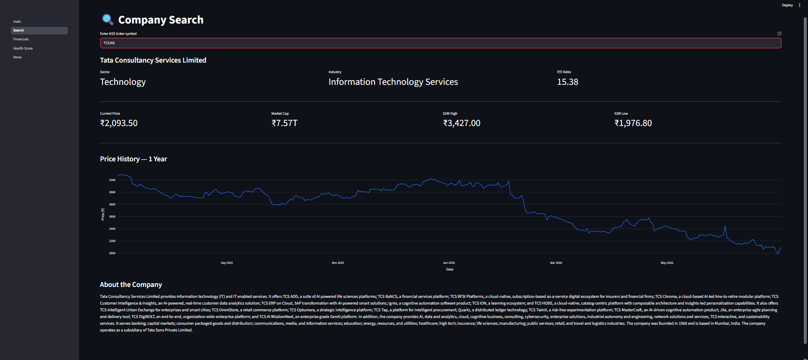
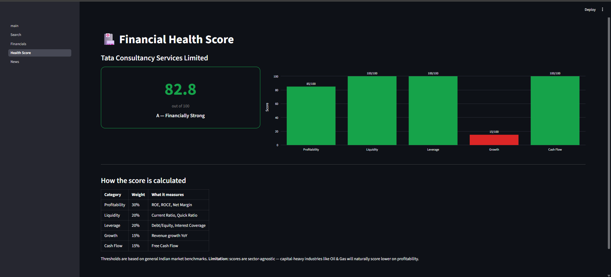

# 📊 Equity Research Workbench

A Streamlit dashboard for analyzing NSE/BSE-listed Indian stocks — live price
data, financial statements, 12 computed ratios, a weighted health score out of
100, and recent news headlines. All data pulled live from Yahoo Finance.

> ⚠️ Built for research and learning. Not investment advice.

> 🔁 This project has been rebuilt as
> [Equity Research Workbench V2](https://github.com/Akashsh-23/Equity-Research-Workbench-V2)
> with percentile-based scoring, SQLite persistence, Excel export, and a
> Power BI dashboard.

---

## What it does

Enter any NSE ticker and the app fetches live data from Yahoo Finance,
computes 12 financial ratios from the raw statements, scores them against
fixed benchmark thresholds, and combines category scores into one overall
health rating out of 100 — with a letter grade and a transparent breakdown
of how the score was calculated.

---

## Features

| Page | What it does |
|---|---|
| **Search** | Any NSE ticker (e.g. `RELIANCE.NS`, `TCS.NS`), live price, 52-week range, 1-year price chart, company overview |
| **Financials** | Income statement, balance sheet, cash flow tabs + all 12 derived ratios |
| **Health Score** | Weighted 0–100 score, letter grade, category breakdown chart, methodology table |
| **News** | Recent headlines via GNews API |

---

## Health score methodology

12 ratios are scored against fixed thresholds and combined using category weights:

| Category | Weight | Ratios used |
|---|---|---|
| Profitability | 30% | Net Margin, ROE, ROCE, Gross Margin, Operating Margin |
| Liquidity | 20% | Current Ratio, Quick Ratio |
| Leverage | 20% | Debt to Equity, Interest Coverage |
| Growth | 15% | Revenue Growth YoY |
| Cash Flow | 15% | Free Cash Flow |

Thresholds are based on general Indian market benchmarks and are the same
for every company regardless of sector.

**Known limitation:** fixed thresholds are sector-blind — a capital-heavy
company (Oil & Gas, Steel) will naturally score lower than an asset-light
company (IT, FMCG) on profitability metrics, regardless of actual
performance. This was the primary motivation for rebuilding as V2, which
uses percentile-based scoring against sector peers instead.

---

## Tech stack

Python · Streamlit · yfinance · pandas · Plotly

---

## Setup

### 1. Clone the repo

```bash
git clone https://github.com/yourusername/equity-research-workbench.git
cd equity-research-workbench
```

### 2. Create and activate a virtual environment

```bash
python -m venv venv

# Windows
venv\Scripts\activate

# macOS/Linux
source venv/bin/activate
```

### 3. Install dependencies

```bash
pip install -r requirements.txt
```

### 4. Add your GNews API key (for the News page)

The News page fetches recent headlines via GNews. A free API key gives you
100 requests/day.

**Get your key:**
1. Go to [gnews.io](https://gnews.io)
2. Click **Get API Key** — sign up with email (free, no card needed)
3. Your key appears on your dashboard immediately

**Add it to the app:**

Open `app/pages/4_News.py` and find:

```python
GNEWS_API_KEY = "your_api_key_here"
```

Replace with your actual key:

```python
GNEWS_API_KEY = "your_actual_key_here"
```

Save the file.

### 5. Run the app

```bash
streamlit run app/main.py
```

Opens at `http://localhost:8501`. Navigate using the sidebar.

---

## Project structure

```
equity-research-workbench/
│
├── app/
│   ├── main.py                 # Streamlit entry point
│   └── pages/
│       ├── 1_Search.py         # Ticker search, live price, chart
│       ├── 2_Financials.py     # Statements, ratios
│       ├── 3_Health_Score.py   # Weighted score + methodology
│       └── 4_News.py           # GNews headlines
│
├── core/
│   ├── fetcher.py              # yfinance wrapper
│   ├── ratios.py               # Ratio calculations from raw statements
│   ├── health_score.py         # Fixed-threshold scoring engine
│   └── news.py                 # GNews API wrapper
│
├── requirements.txt
├── README.md
└── .gitignore
```

---

## Supported tickers

Any NSE-listed stock using the `.NS` suffix:

```
RELIANCE.NS    TCS.NS         INFY.NS        HDFCBANK.NS
ICICIBANK.NS   HINDUNILVR.NS  ITC.NS         SUNPHARMA.NS
TATAMOTORS.NS  MARUTI.NS      WIPRO.NS       KOTAKBANK.NS
```

BSE tickers use the `.BO` suffix (e.g. `RELIANCE.BO`).

---

## Screenshots


```



```

---

## Limitations and what was improved in V2

- **Scoring is sector-blind** — same fixed thresholds for every company
  regardless of industry. V2 uses percentile ranking within sector peer
  groups instead.
- **No persistence** — data lives only in session state, lost on page
  refresh. V2 saves every search to SQLite, enabling history and
  cross-company analysis.
- **Single company at a time** — no way to compare multiple stocks
  side-by-side. V2 adds a Compare page and a Leaderboard.
- **No export** — V2 adds Excel report download and Power BI dashboard.

→ See [V2](https://github.com/Akashsh-23/Equity-Research-Workbench-V2)
for the rebuilt version addressing all of the above.
